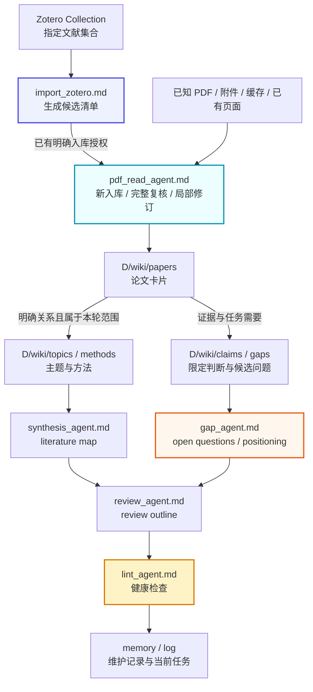

# ResearchWiki / AI 论文知识库系统

[](./LICENSE)

> ResearchWiki is a local paper knowledge-base framework powered by Codex / LLM Agent, Obsidian, and Zotero. It turns scattered PDFs and Zotero records into a maintainable Markdown Wiki for literature review, research gap analysis, positioning, and academic writing.
>
> ResearchWiki 是一个基于 Codex / LLM Agent + Obsidian + Zotero 的本地论文知识库系统，用于将零散 PDF / Zotero 条目转化为可持续维护、可交叉引用、可用于文献综述、research gap 分析和选题定位的 Markdown Wiki。

一句话概括：

> 把论文从“收藏夹”变成“可持续生长的研究 Wiki”。

## 项目来源声明 / Attribution

本项目基于 GitHub 开源项目 [ResearchWiki](https://github.com/jiawei601/ResearchWiki) 建立，在此感谢原作者 [jiawei601](https://github.com/jiawei601) 的工作。本项目沿用原项目的整体框架、智能体工作流与 [MIT 许可证](./LICENSE)，并根据个人研究需要做了调整。

## Table of Contents / 目录

- [What This Project Is / 项目定位](#what-this-project-is--项目定位)
- [Why This Project Exists / 为什么需要它](#why-this-project-exists--为什么需要它)
- [Core Idea / 核心思想](#core-idea--核心思想)
- [Core Workflow / 核心工作流](#core-workflow--核心工作流)
- [Quick Start / 快速开始](#quick-start--快速开始)
- [Agent System / 智能体体系](#agent-system--智能体体系)
- [Knowledge Layers / 知识库分层](#knowledge-layers--知识库分层)
- [Zotero And PDF Ingestion / Zotero 与 PDF 入库](#zotero-and-pdf-ingestion--zotero-与-pdf-入库)
- [Wiki Pages / Wiki 页面类型](#wiki-pages--wiki-页面类型)
- [Synthesis, Gap And Review / 综合、Gap 与综述](#synthesis-gap-and-review--综合gap-与综述)
- [Context And Maintenance / 上下文与维护](#context-and-maintenance--上下文与维护)
- [Configuration / 配置入口](#configuration--配置入口)
- [File Structure / 文件结构](#file-structure--文件结构)
- [Usage Examples / 使用示例](#usage-examples--使用示例)
- [Recommended Workflow / 推荐使用流程](#recommended-workflow--推荐使用流程)
- [Privacy And Open Source Notes / 隐私与开源注意事项](#privacy-and-open-source-notes--隐私与开源注意事项)
- [Roadmap / 后续计划](#roadmap--后续计划)
- [License / 许可证](#license--许可证)

## What This Project Is / 项目定位

ResearchWiki 不是传统文献管理器，也不是普通 RAG 问答工具。它是一个本地 AI 论文知识库框架：让 Codex / LLM Agent 按稳定规则读取论文、生成结构化页面、维护 Obsidian 双链，并持续积累 topic、method、claim、gap、synthesis 和 review。

它的目标是帮助你：

- 从 Zotero / PDF 中读取论文；
- 生成结构化论文卡片；
- 抽取 topic、method、claim、gap；
- 持续更新 Markdown Wiki；
- 支持文献综述、研究定位和 research gap 分析；
- 让 LLM 成为“论文证据管家 + Wiki 维护者 + 综述助手 + Gap 分析助手”。

ResearchWiki 不会替代研究者判断。用户负责选择文献、提出问题、判断研究方向；Codex / Agent 负责整理、链接、记录、更新和检查。

## Why This Project Exists / 为什么需要它

常见论文管理方式各有短板：

- Zotero 适合收藏和引用，但不负责深度结构化；
- 普通聊天记录容易丢失，难以长期复用；
- 单篇 PDF 摘要不能自然形成跨论文积累；
- RAG 每次都像重新检索，缺少稳定的研究脉络；
- 文献综述真正困难的是跨论文比较、claim 证据、gap 识别和研究定位。

ResearchWiki 解决的问题是：

```text
把论文从“收藏夹”变成“可持续生长的研究 Wiki”。
```

## Core Idea / 核心思想

ResearchWiki 使用三层结构：

1. `D/raw/`：原始资料层，保存 PDF、Zotero 导入记录、附件、笔记等。
2. `D/wiki/`：结构化知识层，保存 papers、topics、methods、claims、gaps、reviews。
3. `memory/` + `agents/` + `templates/`：规则层，约束 Codex 如何执行任务。

核心原则：

- 论文卡片不是终点；
- topic、method、claim、gap 是跨论文连接的基本节点；
- synthesis、review 和 research positioning 是知识库真正发挥作用的位置；
- 所有重要判断必须可追溯到具体原文证据，并保留条件、指标和不确定性；
- 不确定内容必须标注为 `待确认`、`待核查` 或 `AI 推断`。

## Core Workflow / 核心工作流



### Workflow Contract / 流程契约

按本轮任务选择步骤，不要求每次执行整条链：

1. **候选清单**：需要从指定 collection 选论文时使用 import_zotero；只要清单就止于清单。
2. **阅读或修订**：已知论文、PDF、缓存、附件或已有页直接进入 pdf_read_agent；复用已明确的对象与授权。
3. **关联维护**：只更新有明确关系且属于本轮范围的页面，其余受影响论断记录待复核。
4. **综合与写作**：按用户问题核对证据和可比性，再生成综合、候选 gap 或大纲，不按论文数量强制产出。
5. **检查**：按范围分开检查结构、证据和流程；结构通过与 processed 均不代表科学结论已核实。

## Quick Start / 快速开始

### Step 0: Clone / 克隆项目

```bash
git clone <你要使用的仓库地址> ResearchWiki
cd ResearchWiki
```

### Step 1: Open In Agent IDE / 用 Codex 打开项目

用 Codex、Cursor、VS Code、Claude Code 或其他 Agent IDE 打开项目目录。也可以把该目录作为 Obsidian vault 打开。

### Step 2: Select Direction / 选择或创建研究方向

先按根AGENTS选择已有方向或新建方向；D是所选方向根。首次配置时按需编辑：

```text
D/memory/project_profile.md
D/memory/tag_taxonomy.md
D/memory/term_aliases.md
```

首次使用填写已确定的信息；已有项目复用配置，未确定的研究问题可保留待确认：

- 研究领域；
- 研究目标；
- 纳入和排除范围；
- Zotero 设置；
- 输出语言和引用偏好；
- 初始标签和术语别名。

个人默认偏好见`memory/user_profile.md`。公共词表`memory/tag_taxonomy.md`与`memory/term_aliases.md`提供通用约定，领域词条只写上方D内词表。规则出处和冲突处理见根AGENTS第3节。

### Step 3: Connect Zotero / 连接 Zotero

需要从 collection 选论文且当前 Zotero 插件/connector 可用时，可以指定集合；使用已知本地来源可跳过此步：

```text
请按照 ResearchWiki 项目规则，调用 agents/import_zotero.md，从 Zotero collection「我的研究方向」中生成候选论文清单。
```

### Step 4: Ingest First Paper / 入库第一篇论文

从具体候选清单选择一篇论文，或直接指定已知对象；已有明确入库授权不再重复确认：
```text
请按 agents/pdf_read_agent.md 入库 D/raw/zotero_imports/我的研究方向/import_plan.md 中编号 1 的论文。
```

也可以直接读取本地 PDF：

```text
请调用 agents/pdf_read_agent.md，读取 D/raw/papers/example-paper.pdf 并完成单篇论文入库。
```

### Step 5: Run Lint / 运行检查

```text
请调用 agents/lint_agent.md，检查刚刚入库的论文是否符合 ResearchWiki 项目规则。
```

## Agent System / 智能体体系

| Agent | File | Role |
|---|---|---|
| Zotero Import Agent | `agents/import_zotero.md` | 从 Zotero collection 识别论文、生成候选清单、交给入库流程 |
| PDF Read Agent | `agents/pdf_read_agent.md` | 新入库、完整复核、局部修订 |
| Synthesis Agent | `agents/synthesis_agent.md` | 多论文综合、literature map、方法对比 |
| Gap Agent | `agents/gap_agent.md` | research gap、open questions、选题定位 |
| Review Agent | `agents/review_agent.md` | 文献综述、related work、review outline |
| Lint Agent | `agents/lint_agent.md` | 按范围区分结构、证据和流程检查 |

## Knowledge Layers / 知识库分层

- `D/wiki/papers/`：单篇论文卡片。
- `D/wiki/topics/`：研究主题聚合。
- `D/wiki/methods/`：方法路线和适用场景。
- `D/wiki/claims/`：有证据支撑的可复用判断。
- `D/wiki/gaps/`：研究空白、限制和机会。
- `D/wiki/reviews/`：综述草稿和 related work。
- `D/synthesis/`：跨论文综合页面。
- 根`memory/`：公共规则、默认偏好与公共维护；`D/memory/`：本方向研究配置、状态与记录。
- `templates/`：页面模板。
- `agents/`：任务型智能体规则。

> 论文卡片不是终点，claim、gap、synthesis 和 review 才是知识库真正发挥作用的位置。

## Zotero And PDF Ingestion / Zotero 与 PDF 入库

ResearchWiki 可通过当前可用的 Zotero 插件/connector 读取指定 collection；工具不可用时明确影响，不假装已读取。已知本地 PDF/缓存直接进入阅读流程，详见 [来源流程](docs/zotero-workflow.md)。范围如下：

- 只处理用户指定 collection；
- 不扫描整个 Zotero library；
- 不扫描整个 Zotero storage；
- 不修改 Zotero 原始条目；
- 不删除、不移动、不重命名 Zotero 附件；
- 单篇入库默认优先；
- 批次由明确对象、清单编号/范围或筛选条件界定，遵循 project_profile 与当前用户指令；已有授权不逐篇重问。
- 原始 PDF、解析缓存、译文和补充材料受保护；不强制复制 PDF。
- 系统生成的 import_plan/manifest 可在获授权任务内同步，不能因此修改原件或 Zotero 条目。

示例：

```text
请按 ResearchWiki 项目规则，调用 agents/import_zotero.md，读取 Zotero collection「我的研究方向」，只生成候选清单，不要入库。
```

```text
请按 agents/pdf_read_agent.md 入库 D/raw/zotero_imports/我的研究方向/import_plan.md 中编号 1–3 的论文。
```

## Wiki Pages / Wiki 页面类型

| Page Type | Folder | Purpose |
|---|---|---|
| Paper | `D/wiki/papers/` | 单篇论文结构化卡片 |
| Author | `D/wiki/authors/` | 作者和研究团队信息 |
| Topic | `D/wiki/topics/` | 研究主题聚合 |
| Method | `D/wiki/methods/` | 方法路线和适用场景 |
| Dataset | `D/wiki/datasets/` | 数据集、实验对象或材料 |
| Metric | `D/wiki/metrics/` | 评价指标 |
| Claim | `D/wiki/claims/` | 有证据支撑的可复用判断 |
| Gap | `D/wiki/gaps/` | 研究空白、限制和机会 |
| Review | `D/wiki/reviews/` | 综述草稿和 related work |
| Synthesis | `D/synthesis/` | 多论文综合、定位和开放问题 |

## Synthesis, Gap And Review / 综合、Gap 与综述

需要比较或写作时再开展综合：先核查具体证据、条件与独立来源，再组织论点；语料缺口不能自动称为领域空白。旧页面不会因已入库而自动通过复核。

```text
请调用 agents/synthesis_agent.md，基于当前已入库论文生成 literature-map。
```

```text
请调用 agents/gap_agent.md，基于当前知识库生成 open-questions 和 research-positioning。
```

```text
请调用 agents/review_agent.md，基于当前知识库生成文献综述大纲。
```

## Context And Maintenance / 上下文与维护

长期使用时，不要依赖聊天历史保存规则；最终决策应该沉淀到 `memory/` 或 `D/synthesis/`。

- `memory/context_policy.md`：增量读取、当前任务与恢复入口。
- `memory/style_snapshot.md`：默认输出风格。
- `D/synthesis/core-argument-map.md`：科学主张、证据关系与研究假设，不保存操作进度。
- `D/memory/error_log.md`：AI 曾经犯过的错误和修正规则。
- `memory/decision_log.md`：结构性决策。
- `agents/lint_agent.md`：定期检查知识库健康。

## Configuration / 配置入口

| File | Purpose |
|---|---|
| `D/memory/project_profile.md` | 项目领域、目标、用户用途 |
| `memory/tag_taxonomy.md` / `D/memory/tag_taxonomy.md` | 公共标签规则 / 本方向领域标签 |
| `memory/term_aliases.md` / `D/memory/term_aliases.md` | 通用术语约定 / 本方向术语别名 |
| `memory/context_policy.md` | 公共恢复机制与架构任务入口 |
| `D/memory/current_context.md` | 所选方向研究进度与恢复入口 |
| `memory/user_profile.md` | 使用者与公共默认偏好 |
| `memory/direction_registry.yaml` | 已登记方向导航 |
| `memory/style_snapshot.md` | 默认输出风格 |
| `templates/paper.md` | 论文卡片模板 |
| `templates/claim.md` | claim 页面模板 |
| `templates/gap.md` | gap 页面模板 |

## File Structure / 文件结构

```text
ResearchWiki/
├── AGENTS.md / CLAUDE.md
├── index.md / log.md / inbox.md   # 公共导航与维护
├── agents/                       # 通用任务流程
├── templates/                    # 公共模板与新方向骨架
├── memory/                       # 公共底线、用户默认、注册表与恢复机制
├── docs/                         # 使用说明与架构记录
├── shared/                       # 可借鉴资源导航
└── directions/
    └── <direction_id>/
        ├── AGENTS.md / index.md / log.md / inbox.md
        ├── memory/               # 方向profile、扩展、当前任务与词表
        ├── raw/                  # papers、notes、assets、zotero_imports
        ├── wiki/                 # papers、topics、methods、claims等
        ├── synthesis/            # 本方向综合与写作
        └── docs/                 # 研究报告与历史
```

本库不在根目录保存方向raw/wiki/synthesis。方向专用模板仅在实际需要时放入该方向templates。

## Usage Examples / 使用示例

### 从 Zotero 生成候选清单

```text
请调用 agents/import_zotero.md，读取 Zotero collection「我的研究方向」，只生成候选入库清单。
```

### 单篇论文入库

```text
请调用 agents/pdf_read_agent.md，入库已知论文「Example Paper Title」，先核对来源并检查是否已有页面。
```

### 批量测试入库

```text
请按 agents/pdf_read_agent.md 入库 D/raw/zotero_imports/我的研究方向/import_plan.md 中编号 1–3 的论文。
```

### 已有论文局部修订

```text
请按 agents/pdf_read_agent.md 修订 D/wiki/papers/<已有论文>.md 中指定结论，核对原文及支撑图表，只更新受影响段落并记录下游待复核项。
```

### 多论文综合

```text
请调用 agents/synthesis_agent.md，基于当前已入库论文生成 literature-map 和 method comparison。
```

### Gap 分析

```text
请调用 agents/gap_agent.md，基于当前知识库生成 research gap 候选清单。
```

### 文献综述

```text
请调用 agents/review_agent.md，基于当前知识库生成文献综述大纲。
```

### 健康检查

```text
请调用 agents/lint_agent.md，对当前 ResearchWiki 做一次健康检查。
```

## Recommended Workflow / 推荐使用流程

1. 首次使用填写配置；继续任务时从 context_policy 恢复。
2. 按已知输入选择候选清单、新入库或已有页面修订。
3. 完成证据与论文页，再检查本轮相关引用及必要维护项。
4. 有明确问题时进行综合、gap 或综述写作，证据不足处保留未决。
5. 阶段切换时更新短状态；需要维护时做限定范围 lint。

本库公共完善进度见[总索引](index.md)和[当前公共任务](memory/context_policy.md)；各方向论文数量与研究进度见其索引和短状态。旧九阶段计划保留在原方向docs中作为历史记录，规则更新不代表旧论文或大纲已经完成证据复核。

## Privacy And Open Source Notes / 隐私与开源注意事项

以下检查只适用于用户明确要求公开发布或制作开源发行副本时。当前工作库可保留私人研究内容；日常阅读、修订和 lint 不触发数据清理或发布。发行内容需逐项确定是否包含：

- 受版权保护的 PDF；
- `D/raw/papers/` 中的真实论文；
- 个人 Zotero item key、attachment key、真实 collection 导入记录；
- 包含个人研究定位的 synthesis 页面；
- 本地文件路径、个人操作日志或私有研究方向；
- `.obsidian/workspace.json` 等本地工作区状态。

制作空白发行模板时在独立副本或用户授权范围内处理，不清空当前工作库。`.gitignore` 不会取消已跟踪文件，具体检查见 [发布说明](docs/privacy-and-gitignore.md)。历史一次上传不自动授权后续提交、推送或公开发布。

## Roadmap / 后续计划

- 更稳定的 Zotero 批量导入。
- Obsidian Dataview 查询模板。
- Claim matrix 自动生成。
- 按证据变化修订 review outline。
- 轻量增量上下文维护（不新增专用 agent）。
- 可选本地 PDF 解析工具。
- 可视化 literature map。

## License / 许可证

This project is released under the [MIT License](./LICENSE).


## 多研究方向入口（2026-09-09生效）

按根AGENTS选择已有方向或新建方向；已明确点名方向直接进入，同一任务不重复选择。D代表本会话绑定的directions/<direction_id>，文中D/是路径占位，不是实际文件夹。个人默认配置见memory/user_profile.md，研究配置及进度见D/memory/project_profile.md和D/memory/current_context.md。公共维护由根index/log管理；论文、原件、研究索引/日志和synthesis均归D。具体操作见docs/direction-workflow.md。
