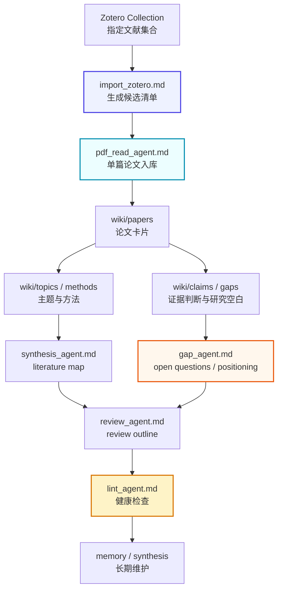

# ResearchWiki / AI 论文知识库系统

[](./LICENSE)

> ResearchWiki is a local paper knowledge-base framework powered by Codex / LLM Agent, Obsidian, and Zotero. It turns scattered PDFs and Zotero records into a maintainable Markdown Wiki for literature review, research gap analysis, positioning, and academic writing.
>
> ResearchWiki 是一个基于 Codex / LLM Agent + Obsidian + Zotero 的本地论文知识库系统，用于将零散 PDF / Zotero 条目转化为可持续维护、可交叉引用、可用于文献综述、research gap 分析和选题定位的 Markdown Wiki。

一句话概括：

> 把论文从“收藏夹”变成“可持续生长的研究 Wiki”。

## Table of Contents / 目录

- [What This Project Is / 项目定位](#what-this-project-is--项目定位)
- [Why This Project Exists / 为什么需要它](#why-this-project-exists--为什么需要它)
- [Core Idea / 核心思想](#core-idea--核心思想)
- [Core Workflow / 核心工作流](#core-workflow--核心工作流)
- [Quick Start / 快速开始](#quick-start--快速开始)
- [Agent System / 智能体体系](#agent-system--智能体体系)
- [Knowledge Layers / 知识库分层](#knowledge-layers--知识库分层)
- [Zotero And PDF Ingestion / Zotero 与 PDF 入库](#zotero-and-pdf-ingestion--zotero-与-pdf-入库)
- [Wiki Pages / Wiki 页面类型](#wiki-pages--wiki-页面类型)
- [Synthesis, Gap And Review / 综合、Gap 与综述](#synthesis-gap-and-review--综合gap-与综述)
- [Context And Maintenance / 上下文与维护](#context-and-maintenance--上下文与维护)
- [Configuration / 配置入口](#configuration--配置入口)
- [File Structure / 文件结构](#file-structure--文件结构)
- [Usage Examples / 使用示例](#usage-examples--使用示例)
- [Recommended Workflow / 推荐使用流程](#recommended-workflow--推荐使用流程)
- [Privacy And Open Source Notes / 隐私与开源注意事项](#privacy-and-open-source-notes--隐私与开源注意事项)
- [Roadmap / 后续计划](#roadmap--后续计划)
- [License / 许可证](#license--许可证)

## What This Project Is / 项目定位

ResearchWiki 不是传统文献管理器，也不是普通 RAG 问答工具。它是一个本地 AI 论文知识库框架：让 Codex / LLM Agent 按稳定规则读取论文、生成结构化页面、维护 Obsidian 双链，并持续积累 topic、method、claim、gap、synthesis 和 review。

它的目标是帮助你：

- 从 Zotero / PDF 中读取论文；
- 生成结构化论文卡片；
- 抽取 topic、method、claim、gap；
- 持续更新 Markdown Wiki；
- 支持文献综述、研究定位和 research gap 分析；
- 让 LLM 成为“论文证据管家 + Wiki 维护者 + 综述助手 + Gap 分析助手”。

ResearchWiki 不会替代研究者判断。用户负责选择文献、提出问题、判断研究方向；Codex / Agent 负责整理、链接、记录、更新和检查。

## Why This Project Exists / 为什么需要它

常见论文管理方式各有短板：

- Zotero 适合收藏和引用，但不负责深度结构化；
- 普通聊天记录容易丢失，难以长期复用；
- 单篇 PDF 摘要不能自然形成跨论文积累；
- RAG 每次都像重新检索，缺少稳定的研究脉络；
- 文献综述真正困难的是跨论文比较、claim 证据、gap 识别和研究定位。

ResearchWiki 解决的问题是：

```text
把论文从“收藏夹”变成“可持续生长的研究 Wiki”。
```

## Core Idea / 核心思想

ResearchWiki 使用三层结构：

1. `raw/`：原始资料层，保存 PDF、Zotero 导入记录、附件、笔记等。
2. `wiki/`：结构化知识层，保存 papers、topics、methods、claims、gaps、reviews。
3. `memory/` + `agents/` + `templates/`：规则层，约束 Codex 如何执行任务。

核心原则：

- 论文卡片不是终点；
- topic、method、claim、gap 是跨论文连接的基本节点；
- synthesis、review 和 research positioning 是知识库真正发挥作用的位置；
- 所有重要判断都要尽量回到论文证据；
- 不确定内容必须标注为 `待确认`、`待核查` 或 `AI 推断`。

## Core Workflow / 核心工作流



### Workflow Contract / 流程契约

1. **Import**：从用户指定 Zotero collection 读取论文，生成候选清单。
2. **Ingest**：对用户确认的单篇论文入库，生成论文卡片。
3. **Link**：更新 topic、method、claim、gap 页面。
4. **Synthesize**：多论文综合，生成 literature-map。
5. **Gap**：生成 open questions 和 research positioning。
6. **Review**：生成文献综述大纲或 related work。
7. **Lint**：检查标签、证据、重复页面、索引、日志和上下文压缩需求。

## Quick Start / 快速开始

### Step 0: Clone / 克隆项目

```bash
git clone https://github.com/jiawei601/ResearchWiki.git
cd ResearchWiki
```

### Step 1: Open In Agent IDE / 用 Codex 打开项目

用 Codex、Cursor、VS Code、Claude Code 或其他 Agent IDE 打开项目目录。也可以把该目录作为 Obsidian vault 打开。

### Step 2: Configure Project Profile / 配置项目画像

优先编辑：

```text
memory/project_profile.md
memory/tag_taxonomy.md
memory/term_aliases.md
```

至少填写：

- 研究领域；
- 研究目标；
- 纳入和排除范围；
- Zotero 设置；
- 输出语言和引用偏好；
- 初始标签和术语别名。

### Step 3: Connect Zotero / 连接 Zotero

如果使用 Codex Zotero 插件，可以指定某个 Zotero collection：

```text
请按照 ResearchWiki 项目规则，调用 agents/import_zotero.md，从 Zotero collection「我的研究方向」中生成候选论文清单。
```

### Step 4: Ingest First Paper / 入库第一篇论文

从候选清单中选择一篇论文：

```text
请调用 agents/import_zotero.md 和 agents/pdf_read_agent.md，从 Zotero collection「我的研究方向」中入库论文「Example Paper Title」。
```

也可以直接读取本地 PDF：

```text
请调用 agents/pdf_read_agent.md，读取 raw/papers/example-paper.pdf 并完成单篇论文入库。
```

### Step 5: Run Lint / 运行检查

```text
请调用 agents/lint_agent.md，检查刚刚入库的论文是否符合 ResearchWiki 项目规则。
```

## Agent System / 智能体体系

| Agent | File | Role |
|---|---|---|
| Zotero Import Agent | `agents/import_zotero.md` | 从 Zotero collection 识别论文、生成候选清单、交给入库流程 |
| PDF Read Agent | `agents/pdf_read_agent.md` | 单篇论文结构化入库 |
| Synthesis Agent | `agents/synthesis_agent.md` | 多论文综合、literature map、方法对比 |
| Gap Agent | `agents/gap_agent.md` | research gap、open questions、选题定位 |
| Review Agent | `agents/review_agent.md` | 文献综述、related work、review outline |
| Lint Agent | `agents/lint_agent.md` | 标签、证据、重复页面、上下文健康检查 |

## Knowledge Layers / 知识库分层

- `wiki/papers/`：单篇论文卡片。
- `wiki/topics/`：研究主题聚合。
- `wiki/methods/`：方法路线和适用场景。
- `wiki/claims/`：有证据支撑的可复用判断。
- `wiki/gaps/`：研究空白、限制和机会。
- `wiki/reviews/`：综述草稿和 related work。
- `synthesis/`：跨论文综合页面。
- `memory/`：长期规则、项目配置、错误记录和上下文管理。
- `templates/`：页面模板。
- `agents/`：任务型智能体规则。

> 论文卡片不是终点，claim、gap、synthesis 和 review 才是知识库真正发挥作用的位置。

## Zotero And PDF Ingestion / Zotero 与 PDF 入库

ResearchWiki 支持通过 Codex Zotero 插件读取指定 collection。默认安全边界如下：

- 只处理用户指定 collection；
- 不扫描整个 Zotero library；
- 不扫描整个 Zotero storage；
- 不修改 Zotero 原始条目；
- 不删除、不移动、不重命名 Zotero 附件；
- 单篇入库默认优先；
- 批量入库需要用户明确指定编号或范围。

示例：

```text
请按 ResearchWiki 项目规则，调用 agents/import_zotero.md，读取 Zotero collection「我的研究方向」，只生成候选清单，不要入库。
```

```text
请调用 agents/import_zotero.md 和 agents/pdf_read_agent.md，从 Zotero collection「我的研究方向」中入库 3 篇有 PDF 附件的论文。
```

## Wiki Pages / Wiki 页面类型

| Page Type | Folder | Purpose |
|---|---|---|
| Paper | `wiki/papers/` | 单篇论文结构化卡片 |
| Author | `wiki/authors/` | 作者和研究团队信息 |
| Topic | `wiki/topics/` | 研究主题聚合 |
| Method | `wiki/methods/` | 方法路线和适用场景 |
| Dataset | `wiki/datasets/` | 数据集、实验对象或材料 |
| Metric | `wiki/metrics/` | 评价指标 |
| Claim | `wiki/claims/` | 有证据支撑的可复用判断 |
| Gap | `wiki/gaps/` | 研究空白、限制和机会 |
| Review | `wiki/reviews/` | 综述草稿和 related work |
| Synthesis | `synthesis/` | 多论文综合、定位和开放问题 |

## Synthesis, Gap And Review / 综合、Gap 与综述

入库多篇论文后，不要让知识库停留在“收藏夹”状态。建议每入库 3-5 篇论文，就做一次 synthesis、gap 和 lint。

```text
请调用 agents/synthesis_agent.md，基于当前已入库论文生成 literature-map。
```

```text
请调用 agents/gap_agent.md，基于当前知识库生成 open-questions 和 research-positioning。
```

```text
请调用 agents/review_agent.md，基于当前知识库生成文献综述大纲。
```

## Context And Maintenance / 上下文与维护

长期使用时，不要依赖聊天历史保存规则；最终决策应该沉淀到 `memory/` 或 `synthesis/`。

- `memory/context_policy.md`：上下文预算与压缩规则。
- `memory/style_snapshot.md`：默认输出风格。
- `synthesis/core-argument-map.md`：核心论点和项目状态快照。
- `memory/error_log.md`：AI 曾经犯过的错误和修正规则。
- `memory/decision_log.md`：结构性决策。
- `agents/lint_agent.md`：定期检查知识库健康。

## Configuration / 配置入口

| File | Purpose |
|---|---|
| `memory/project_profile.md` | 项目领域、目标、用户用途 |
| `memory/tag_taxonomy.md` | 标签体系 |
| `memory/term_aliases.md` | 术语别名和标准写法 |
| `memory/context_policy.md` | 上下文预算和压缩规则 |
| `memory/style_snapshot.md` | 默认输出风格 |
| `templates/paper.md` | 论文卡片模板 |
| `templates/claim.md` | claim 页面模板 |
| `templates/gap.md` | gap 页面模板 |

## File Structure / 文件结构

当前项目结构：

```text
.
├── AGENTS.md
├── README.md
├── QUICKSTART.md
├── LICENSE
├── .gitignore
├── index.md
├── log.md
├── inbox.md
├── agents/
│   ├── import_zotero.md
│   ├── pdf_read_agent.md
│   ├── synthesis_agent.md
│   ├── gap_agent.md
│   ├── review_agent.md
│   └── lint_agent.md
├── templates/
│   ├── pdf_ingestion_template.md
│   ├── paper.md
│   ├── topic.md
│   ├── method.md
│   ├── claim.md
│   ├── gap.md
│   └── review.md
├── memory/
│   ├── project_profile.md
│   ├── hard_memory.md
│   ├── context_policy.md
│   ├── style_snapshot.md
│   ├── tag_taxonomy.md
│   ├── term_aliases.md
│   ├── error_log.md
│   └── decision_log.md
├── raw/
│   ├── papers/
│   ├── notes/
│   ├── assets/
│   └── zotero_imports/
├── wiki/
│   ├── papers/
│   ├── authors/
│   ├── topics/
│   ├── methods/
│   ├── datasets/
│   ├── metrics/
│   ├── claims/
│   ├── gaps/
│   └── reviews/
├── synthesis/
│   ├── literature-map.md
│   ├── open-questions.md
│   ├── research-positioning.md
│   ├── review-outline.md
│   └── core-argument-map.md
└── docs/
    ├── initialization.md
    ├── zotero-workflow.md
    ├── obsidian-setup.md
    └── privacy-and-gitignore.md
```

## Usage Examples / 使用示例

### 从 Zotero 生成候选清单

```text
请调用 agents/import_zotero.md，读取 Zotero collection「我的研究方向」，只生成候选入库清单。
```

### 单篇论文入库

```text
请调用 agents/import_zotero.md 和 agents/pdf_read_agent.md，入库 Zotero collection「我的研究方向」中的论文「Example Paper Title」。
```

### 批量测试入库

```text
请按 ResearchWiki 项目规则，从 Zotero collection「我的研究方向」中入库 3 篇有 PDF 附件的论文。
```

### 多论文综合

```text
请调用 agents/synthesis_agent.md，基于当前已入库论文生成 literature-map 和 method comparison。
```

### Gap 分析

```text
请调用 agents/gap_agent.md，基于当前知识库生成 research gap 候选清单。
```

### 文献综述

```text
请调用 agents/review_agent.md，基于当前知识库生成文献综述大纲。
```

### 健康检查

```text
请调用 agents/lint_agent.md，对当前 ResearchWiki 做一次健康检查。
```

## Recommended Workflow / 推荐使用流程

1. 配置 `memory/project_profile.md`。
2. 配置 `memory/tag_taxonomy.md` 和 `memory/term_aliases.md`。
3. 从 Zotero 或本地 PDF 入库第一篇论文。
4. 运行 `agents/lint_agent.md`。
5. 入库 3-5 篇论文。
6. 运行 `agents/synthesis_agent.md`。
7. 运行 `agents/gap_agent.md`。
8. 生成 `synthesis/review-outline.md`。
9. 根据缺口继续补论文。
10. 定期 lint 和 context compaction。

## Privacy And Open Source Notes / 隐私与开源注意事项

请不要提交：

- 受版权保护的 PDF；
- `raw/papers/` 中的真实论文；
- 个人 Zotero item key、attachment key、真实 collection 导入记录；
- 包含个人研究定位的 synthesis 页面；
- 本地文件路径、个人操作日志或私有研究方向；
- `.obsidian/workspace.json` 等本地工作区状态。

开源模板应使用空白结构和示例占位。项目已提供 `.gitignore`，但发布前仍建议手动搜索本地路径、论文题名、Zotero key 和 DOI。

## Roadmap / 后续计划

- 更稳定的 Zotero 批量导入。
- Obsidian Dataview 查询模板。
- Claim matrix 自动生成。
- Review outline 自动更新。
- Context compaction agent。
- 可选本地 PDF 解析工具。
- 可视化 literature map。

## License / 许可证

This project is released under the [MIT License](./LICENSE).
