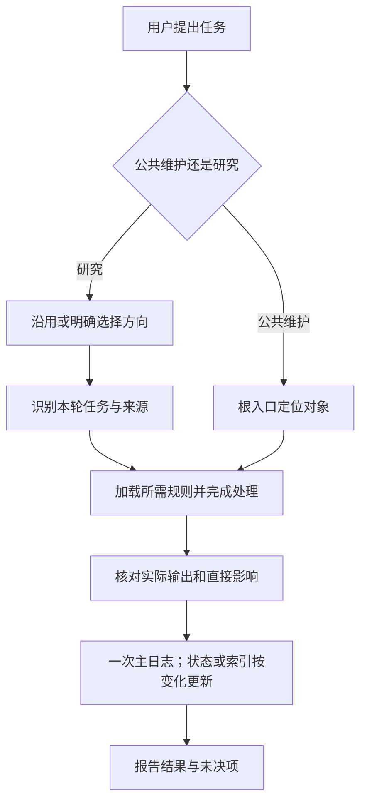

# calude_wiki_2.0 系统评价与流程优化方案

日期：2026-09-10。状态：阶段A–C已实施并完成各自限定验收，见[阶段A报告](optimization-stage-a-2026-09-10/report.md)、[阶段B报告](optimization-stage-b-2026-09-10/report.md)及[阶段C报告](optimization-stage-c-2026-09-10/report.md)；阶段D首篇电子封装论文案例也已完成，见[阶段D报告](optimization-stage-d-2026-09-10/report.md)。下列发现与统计保留初轮检查基线，实际处理进度以阶段报告和当前短状态为准。

用户目标：支持教授并行开展多个研究方向，保持研究规则、证据与任务隔离，允许有来源和条件的借鉴，同时减少重复阅读、确认、记录和维护。

## 1. 结论与检查边界

当前结构适合继续增设研究方向，证据标准也较完整。主要改进空间是规则重复、示例漂移、任务收尾成本和可重复验收不足。建议保留现有目录结构，先统一规则出处、减少重复产物，再补轻量检查和真实任务验收。

评估基线为 `calude_wiki_2.0`，提交 `4eae5432a59376156c38ccfde6a9bd6cf661ac25`。2026-09-10已成功推送，远程main与标签解引用一致；这仅证明该Git版本已上传，不证明忽略文件或外部附件已备份。

本轮实际检查：根入口、公共记忆、六份通用流程、通用模板、使用说明、两个方向的配置/规则与短状态、阶段3/4验收记录、现有脚本位置和阶段3脚本逻辑。另解析两个方向wiki/synthesis页面的frontmatter，检查重复键与direction_id。方向配置仅作为架构检查对象，不将其研究任务绑定到本轮。

本轮未做：论文原文复核、真实入库、外部Zotero/MinerU访问、完整链接/锚点检查、独立新会话或Obsidian桌面实测、性能计时、备份恢复演练。不执行历史迁移脚本，不修改研究页面。

## 2. 实际基线与评价

| 维度 | 事实与评价 | 限制 |
|---|---|---|
| 方向结构 | 两个已注册独立方向；陶瓷腐蚀wiki/synthesis共32页，电子封装0页 | 新方向已有配置，尚无真实论文验证 |
| 结构字段 | 32页YAML可解析、未发现重复键、direction_id与目录一致 | 不代表其他字段或链接全部合格 |
| 核查标记 | 31页声明checked；1页为组外文献登记表，仅有direction_id | checked是已有声明，本轮不背书科学正确性；登记表不能套论文必填规则 |
| 证据标准 | 已区分实测/计算/解释/转引、支持程度、核查状态、可比性和数据独立性 | 优点在规则层；实际质量需按论断回原文验证 |
| 启动负担 | 根AGENTS、hard_memory、user_profile、注册表合计8,056字符 | 按UTF-8文本读取、换行归一统计；不是token数或实际每轮消耗 |
| 阅读流程负担 | pdf_read_agent、paper模板和阅读检查单合计11,853字符、424行 | 尚未加方向扩展；已有增量复用规则，不能假定每轮都重读 |
| 规则重复 | 五份agent共享完全相同的242字符入口段，六份共享119字符边界段；lint另有近似入口 | 重复可能帮助提醒，但目前已包含无关任务说明并出现漂移 |
| 验收能力 | 有迁移/文件演练脚本；已跟踪脚本中未见日常通用检查入口 | 阶段3脚本第62行断言只有陶瓷腐蚀目录，不能直接用于当前两方向日常验收 |
| 恢复能力 | 有Git版本、迁移本地备份及短状态规则 | 外部来源不在迁移备份内；目前检查范围内未见持续备份及恢复演练规程 |

32页包括10篇paper、8项claim、5项gap、2个topic、1篇review、5个type为synthesis的页面及1个登记表。电子封装尚未产出科学知识页，不把空目录算作成果。

不采用主观百分制总分：目前证据足以评价结构与规则一致性，尚不足以给阅读准确率、恢复可靠性或运行效率打分。

## 3. 发现清单

优先级按实施顺序划分：P1先统一或补齐，P2随后简化和试用，P3有实际需求再做。它们不表示已经发现研究结论错误。

| ID | 优先级/性质 | 位置与已发现事实 | 影响及拟处理 |
|---|---|---|---|
| O01 | P1，已确认示例不一致 | [lint规则](../agents/lint_agent.md)明确双链结束后附#E1不算已验证跳转；claim/gap/method/review模板和synthesis/review流程共六处仍示范这种写法 | 改成可解析的证据定位示例；同时明确证据ID与标题锚点的关系，不能只把#移进双链便宣称正确 |
| O02 | P1，已确认字段歧义 | [综合流程](../agents/synthesis_agent.md)的Review status列示范checked / partial / needs-review；正式页面review_status为draft / checked / needs-review | 区分页面核查状态与单条证据覆盖状态，给字段规定唯一名称/取值；不将partial自动映射成checked |
| O03 | P1，已确认说明漂移 | [README](../README.md)初始配置仍只列根词表，配置表未明确领域词表；尾部用既有七篇及方向旧九阶段计划描述全库规则进度 | 明确公共/方向词表，公共进度指向公共入口，数量从方向入口查；历史七篇记录若保留须明确属于历史范围 |
| O04 | P2，已确认重复 | 六份agent重复方向边界；根AGENTS、hard_memory、context_policy和多份说明重复导航/维护；阅读流程、检查单和paper模板均有长检查项 | 每条规则有一个权威出处；其余保留一句入口与任务特有差异，不再完整复制 |
| O05 | P2，设计成本 | [paper模板](../templates/paper.md)同时有Takeaway、Findings、Conclusions for Reuse、Notes for Review Writing；检查单又要求完整使用 | 保留一份证据记录和一份可复用结论；写作用途按需出现。明确检查单用于检查，不另行填一份记录；保留所有关键证据字段 |
| O06 | P1，流程缺口 | [阅读流程](../agents/pdf_read_agent.md)已要求下游复核，但依赖可能散落在正文、源页和维护记录中；缺少稳定E#的修订约定 | 规定已引用E#不重新编号、不复用撤回编号；写作前定向检查源页未决及直接依赖，后续可自动生成反向引用候选 |
| O07 | P2，维护成本 | 当前状态分散于index/inbox/current_context/log；发布已完成但这些入口仍保留待核验措辞 | 当前任务只在短状态权威维护；index导航、inbox候选、log历史。其他入口引用状态，数量和进度尽量不重复手写 |
| O08 | P1，验收缺口 | [阶段3报告](migration-stage3-2026-09-09/report.md)明确独立会话和桌面未实测；[脚本](migration-stage3-2026-09-09/rehearsal.py)含单方向断言 | 保留历史脚本/报告；另设计基于当前注册表的只读检查，再做真实任务和新会话验收。不能把历史模型演练称为运行时隔离 |
| O09 | P1，恢复缺口 | 新建方向涉及多个文件和注册表；现有规程未明确定义部分失败的恢复状态。同方向并行编辑也缺少收尾冲突检查 | 成功核对骨架后登记；已登记任务恢复时先辨别完成/部分完成，保留已成功结果；写入前复查目标是否被其他任务改变。先采用流程约定，无需立即增加锁服务 |
| O10 | P2，资源复用未验证 | [shared目录](../shared/resource_catalog.md)只有登记说明，暂无资源；原始来源版本在各论文页记录 | 首次真实借鉴时登记来源身份、版本、原条件、接收用途和未验证假设；先做一例，不建立全库统一结论或搬迁raw |
| O11 | P1，备份缺口 | [.gitignore](../.gitignore)排除方向raw、外部资料及本地备份；生成的import_plan/manifest也位于raw中 | 明确知识文件、导入管理记录、外部来源三类恢复范围；导入管理记录能维护不等于已备份。先盘点可恢复性，再讨论备份目的地/频率并做隔离恢复演练 |
| O12 | P2，入口与措辞 | [方向工作流程](direction-workflow.md)说明选择由对话规则提供；陶瓷profile仍有默认单篇确认制，但下句又豁免已授权批次 | 保留默认批次偏好，统一已授权对象不逐篇重问的表述；提供自然语言入口。若用户需要真正弹窗，再独立讨论界面实现 |

O04/O05目前是可简化机会，没有实测证明它们已导致每次重复读取或填表。O09是检查范围内未充分规定的恢复场景，不表示已发生丢失。O11不是备份不存在的断言，而是当前Git/迁移备份不能覆盖所有来源。

## 4. 建议采用的工作方式

### 4.1 文件职责

| 位置 | 负责什么 | 精简方式 |
|---|---|---|
| 根AGENTS | 公共维护/研究路由、方向绑定、作用域、规则优先级 | 保留必要护栏，具体科学标准指向hard_memory |
| hard_memory | 证据质量、来源与原件保护的公共底线 | 完整保留判断标准，移除重复导航和过程流水 |
| agents | 某类任务的输入、必要动作、输出和完成门槛 | 缩短重复入口；相同证据检查引用公共规则 |
| templates | 页面最小格式与可选扩展 | 不再容纳第二套执行流程，不要求留空栏目 |
| 方向AGENTS/profile/扩展 | 用户确认的方向范围、偏好、领域差异 | 用户目标、AI工作建议与未定项分开；不复写公共规则 |
| current_context / context_policy当前任务段 | 本方向/公共任务的唯一短状态入口 | 保留任务、范围、完成边界、下一步、必要链接；机制与历史不混写 |
| index / inbox / log | 导航 / 待选择事项 / 已发生操作 | 状态以引用为主，一次操作只写一条主日志；错误和决定链接相关记录 |

先在现有文件中完成这些职责，不为整理规则再创建一套并行总规则。

### 4.2 日常最短流程

- 问一个已有知识问题：选定范围后定位相关证据并回答；普通只读问答沿用现有不机械写盘规则。
- 新入库一篇：核对来源/去重 → 阅读与证据记录 → 一份paper → 检查直接关联 → 必要维护。不强制经过collection清单、claim、gap和综述。
- 修正一句结论：核对该句及依赖材料 → 修正文段和本页引用 → 检查直接下游。存在正确、未变证据时不重读全文、不重填整卡。
- 多论文比较：优先复用已核证据；仅补本次比较需要的条件、来源独立性与争议核查。
- 跨方向借鉴：明确接收方向 → 定向只读来源 → 接收方向记录独立评价；来源方向研究记录保持不变。

这些简化大部分已有原则支持，本次重点是让模板和收尾动作与原则一致，而不是再增加一整套流程。

### 4.3 论文卡片的拟议最小格式

1. 来源身份与实际阅读覆盖。
2. 研究问题与理解结论所必需的设计。
3. 关键证据E#：对象/条件、指标/结果/单位、定位、证据类型、支持边界、核查范围。
4. 可复用结论：引用E#，区分结果、作者解释和本次评价，保留限制。
5. 已知未决与直接下游影响；无相关影响时简短注明即可。

其他栏目按需要展开。用户希望完整精读时可以保留贡献评价、设计细节等扩展；“简洁”不意味着降低原文覆盖，也不允许略过关键图表。先用新增论文试用，再决定是否调整旧页；不批量压缩32页既有内容。

证据编号建议：同一paper内E1、E2稳定不复用；链接指向真实标题或明确块标识，显示文字可以简写。修改内容可保留原ID，拆分/撤回须保留说明和直接引用处置。具体锚点方案在阶段A先用小样例核对，不能假定现有标题就是裸E1。

### 4.4 需要守住的底线

不降低来源定位、实际阅读覆盖、条件/单位/不确定性、实测与解释区分、可比性、同源数据识别、关键图表回查和错误下游处置。不能用结构自动检查提升checked，也不能因为一个页面字段完整而允许所有结论直接用于综述。

精简目标是减少同一判断被多处重复写入和检查，保留决定科学结论是否成立的步骤。

## 5. 分阶段实施与验收

| 阶段 | 具体修改/产物 | 完成判据 | 边界 |
|---|---|---|---|
| A：统一规则与示例 | 建立规则出处对照；修O01/O02/O03/O12；补稳定证据ID约定；缩短重复入口 | 六处示例统一；页面状态与证据覆盖取值不混用；领域配置指向正确；主要任务仍能找到全部必要约束 | 优先只改公共规则/模板/说明；方向历史偏好不擅自取消，研究正文不变 |
| B：精简模板与收尾 | 试行最小paper结构；阅读检查单改成一次性检查入口；规定各记录文件的更新触发条件 | 不另填第二份论文卡片；普通问答零强制研究文件更新；局部修订不触发完整模板；改变状态时才维护短状态 | 不机械改旧论文，不减少关键证据要求 |
| C：补轻量结构与恢复检查 | 新增独立于迁移脚本的只读检查入口；明确中断恢复、写前漂移检查与备份范围 | 识别注册表重复/越界、方向错配、YAML重复键、支持语法范围内的断链/锚点；模板示例不误报；检查不写研究文件 | 不自动修复语义，不自动合并页面；备份目的地和外部资料范围另行明确 |
| D：真实任务验收 | 电子封装首篇论文；一次已知论文局部修订；一个定向借鉴案例；新会话选择/恢复；一次备份恢复演练 | 每例报告真实输入、改动文件、证据覆盖和未决；非目标方向文件不变；重复继续不重复建页；恢复文件可核对 | 真实论文及来源须明确；会话行为不能以脚本变量模拟替代；没有案例就标待验证 |

阶段C可以先做公共只读检查，不受阶段D首篇论文是否已选影响。阶段D中可使用本机现有、已明确身份的来源开展恢复检查；不能为验证而随意读取整个外部文库。

验收建议跟踪：每种任务实际加载的规则字符量、重复确认次数、重复建页次数、无变化却重写的记录数、非目标方向改动数、关键结论可定位率，以及完成时间。除当前文件字符数外，这些指标尚未测量；不预先承诺节省百分比。

硬门槛建议：非目标方向意外写入为0；已确认对象的重复确认和重复建页为0；本轮确定性核心结论均可定位；所有未检查项目明确保留未验证。小样本通过仅覆盖所测案例，不能当系统普遍保证。

## 6. 暂缓项目与讨论重点

当前先保持Markdown目录与现有编辑方式。尚无检索性能或规模瓶颈的实测证据，不把新增数据库、向量检索、复杂自动同步或图谱数量作为本轮完成条件。今后若出现具体查询遗漏或维护规模问题，再用真实案例比较改进价值。

保留作者/方法/指标等分类能力，但可以按有内容时创建文件；空文件夹是否减少属于小收益事项，不优先迁移已有目录。跨方向继续共享来源与方法线索，各方向保留结论的独立适用范围。

建议先讨论两个影响较大的选择：日常论文输出是否采用“精简正文＋按需展开细节”；首轮实施是否按A→B→C→D推进。推荐先做A，并保持完整证据要求。用户偏好确定后更新本方案，不把当前建议写成已接受规则。

## 7. 初轮评估记录与接续

本轮仅新增评估方案并更新公共导航、短状态、待办及日志/错误记录；运行规则、模板和研究页尚未改变。本轮不提交、不上传，不移动calude_wiki_2.0标签。

初轮建议已由用户后续指令推进到阶段A–C，并完成阶段D首篇电子封装论文案例。后续仍需用真实任务验证局部修订、跨方向借鉴、独立新会话/Obsidian桌面和备份恢复；缺少输入只阻断对应案例，不扩大首篇主PDF的核查范围。

### 阶段A复查后的调整

- 规则出处统一，同时保留agent启动提醒；不把简单删除重复段落当作可靠优化。
- 证据ID新建采用稳定标题，旧页保留实际定位；不批量改名、重编号或升级review_status。
- 单条证据范围用实际文字记录，避免为统一状态新增强制填表。
- 只澄清陶瓷已有批次授权表述，保留默认上限和研究目标。
- 阶段A优先保证一致性与兼容性；agent文本缩短，但首次启动公共文本增长，不承诺未经测量的总体提速。详见阶段A报告。
